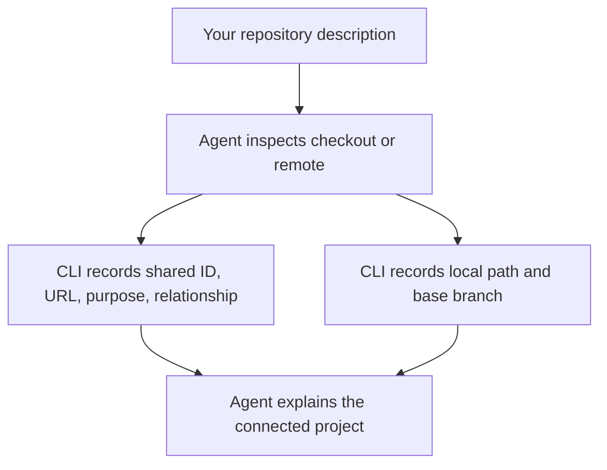

## Describe the repositories

Give the agent the repository's role, where to obtain it, a short logical ID, and this machine's starting branch.

```text
Connect the existing checkout at ../billing-api as `api`. It owns billing rules,
and this machine starts work from `main`.
```

```text
Clone https://github.com/acme/billing-web.git into repositories/web as `web`.
Start from `main` and record that `web` consumes the `api`.
```

The agent inspects each checkout and remote, then uses the CLI to record the shared repository identity, machine-local checkout path, base branch, and relationship. It reports conflicts or missing facts instead of guessing.



## Default is not base

The shared `default_branch` describes the remote repository. This machine's `base_branch` is where work starts and the default delivery target. Tell the agent explicitly when they differ:

```text
The shared default for `api` is `main`, but this machine must start and deliver
against `release/24.4`.
```

Recording a base branch does not create, switch, or reset it. The agent preserves the checkout's current work. A repository can be connected before its first commit, but isolated implementation worktrees need a commit.

## Bind the workspace separately

The repository carrying Context Circuit records is separate from implementation repositories:

```text
Connect this workspace's own Git repository so the team knows where shared
records travel. Do not add it as an implementation repository.
```

Review [repository relationships](/docs/reference/relationships) when a change crosses boundaries.
