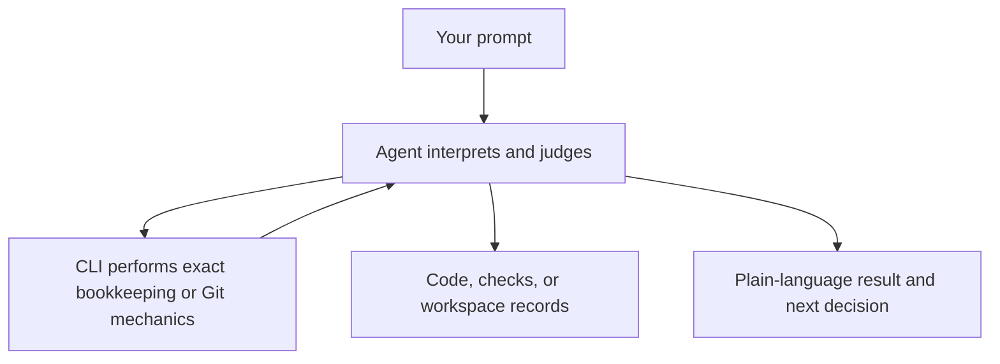

## Start with knowledge

Describe the outcome in project language:

```text
Let customers download an invoice as a PDF. Preserve the current authorization
rules and audit trail.
```

The agent retrieves the smallest relevant set of accepted project knowledge. It reads the request against that context, writes an intent with success criteria and numbered open questions, and stops. The CLI allocates the intent ID and maintains the record shape; it does not decide what the outcome means.

## Read the outcome, then approve

Answer questions by number, then approve only when the written outcome is correct:

```text
1. Include paid and overdue invoices.
2. Use the invoice number as the filename.
3. Record every download in the existing audit trail.
```

```text
The intent now matches what I want. I approve it.
```

The agent passes your exact approval words to the CLI. Approval authorizes planning only. The agent then investigates real code, decides which repositories are involved, and writes linked plans. The CLI allocates plan IDs and links records; it does not inspect code or author the plan.

## Ask to execute after plans exist

Once the plans are visible, make a new request:

```text
Execute all plans for this intent. Prepare the required worktrees, implement the
approved outcome, run the repository checks, and report anything unverified.
```

The agent asks the CLI for dependency order and worktree preparation. It then implements the outcome, runs the actual repository checks, and commits implementation work on the prepared plan branches. The CLI does not execute code, run tests, commit, or claim that work succeeded.

## Deliver, then close the circuit

Delivery is another explicit request:

```text
Push the completed plan branches and open pull requests against this machine's
recorded base branches.
```

After the work lands:

```text
The invoice PDF changes have landed. Mark the plans complete with these exact
words and reconcile any durable knowledge that changed.
```

The agent uses ordinary Git and provider tools for delivery. For completion, it gives your exact note to the CLI, then judges whether the accepted project knowledge must change. The CLI records completion but cannot make that knowledge judgment.



<Callout title="Separate decisions">Delivery does not mark a plan complete. Completion does not remove worktrees or branches. Cleanup requires its own request.</Callout>

Use the [workflow guides](/docs/workflows) for deeper explanations of each conversation stage, or the [prompt cookbook](/docs/prompts) for more supported cases.
