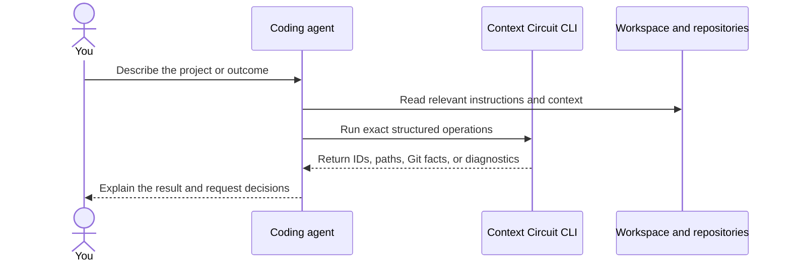
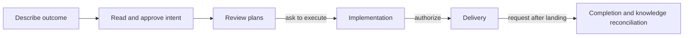

You work with Context Circuit by talking to your coding agent in ordinary project language. You do not need to choose CLI commands, allocate record IDs, or manage Context Circuit files yourself.

The agent interprets the request, checks the workspace rules, and calls the pinned CLI when exact bookkeeping or Git mechanics are needed. The CLI reports structured facts back to the agent; the agent explains those facts and asks for decisions in project language.



## Start a new workspace

After creating the template folder and opening it in Cursor, Codex, or Claude Code, say:

```text
Install the Context Circuit CLI version this workspace pins. Then initialize this
workspace as “Acme Billing” for our subscription billing product. Add me as Maya.
```

The agent resolves the correct binary for its execution environment, verifies it, initializes the shared project identity, creates your local member binding, and configures native agent roles. It does not expect you to translate that request into commands.

## Connect the project

```text
Connect the existing checkout at ../billing-api as `api`, starting from `main`.
It owns billing rules. Then clone our billing web repository as `web` and record
that `web` consumes the `api`.
```

The agent checks the repositories and asks about missing choices. The CLI records shared repository identities and relationships separately from this machine's checkout paths and base branches.

## Take one change through the circuit

```text
Let customers download an invoice as a PDF. Preserve the current authorization
rules and audit trail.
```

The agent retrieves relevant knowledge and presents the intended outcome with numbered questions. After you approve that written outcome, it investigates real code and presents plans. You then request execution, delivery, and completion as separate decisions.



The following pages show the prompts to use and what the agent does with the CLI at each step.

<TopicList>
<Topic href="/docs/get-started/install" title="Setup Context Circuit">Create a clean workspace from template 2.1.0 with Tembiter.</Topic>
<Topic href="/docs/get-started/install-cli" title="Install the CLI">Install the native binary this workspace pins.</Topic>
<Topic href="/docs/get-started/initialize" title="Initialize a workspace">Record project identity and the first member once.</Topic>
<Topic href="/docs/get-started/connect-repositories" title="Connect repositories">Give each repository a shared identity and a local checkout.</Topic>
<Topic href="/docs/get-started/first-workflow" title="First Context Circuit workflow">One bounded product change through the full lifecycle.</Topic>
</TopicList>
