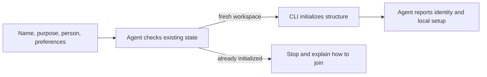

## Tell the agent about the project

```text
Initialize this as the “Acme Billing” workspace. Its purpose is subscription
billing for small businesses. Add me as Maya. Write my intents and plans in
Indonesian with a semi-formal tone, while keeping technical terms in English.
```

The agent confirms any missing identity choices, derives a readable member ID, and uses the pinned CLI to create the shared workspace structure and local member binding. It then refreshes native agent-role definitions for the hosts this workspace supports.

The CLI allocates and writes the structured fields. The agent writes the meaningful project description and language preferences. Initialization preserves existing files and refuses to silently reinitialize an active workspace.



## Join an existing workspace

A clone already carries the shared project identity. Do not initialize it again. Say:

```text
This is an existing team workspace. Set up this machine for the existing member
`maya`, connect the workspace checkout starting from `main`, and refresh the
native agent roles without overwriting custom definitions.
```

The agent asks you to choose if the member ID is ambiguous, then uses the CLI to create only machine-local bindings. Host role definitions are ignored by Git, so a fresh clone needs local setup and the coding host may need to reload them.

Then [connect the implementation repositories](/docs/get-started/connect-repositories).
