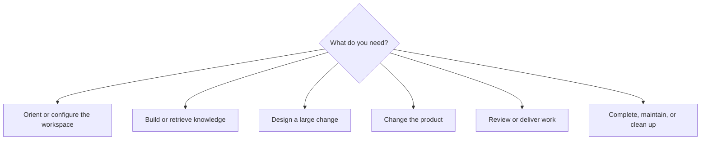
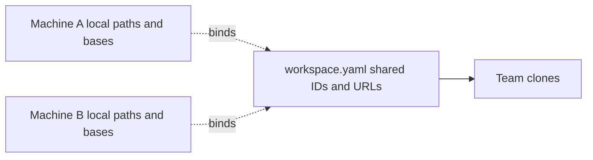
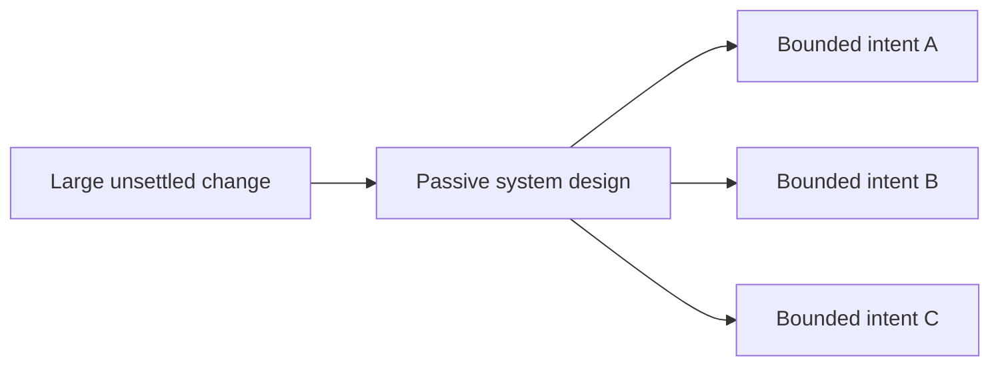
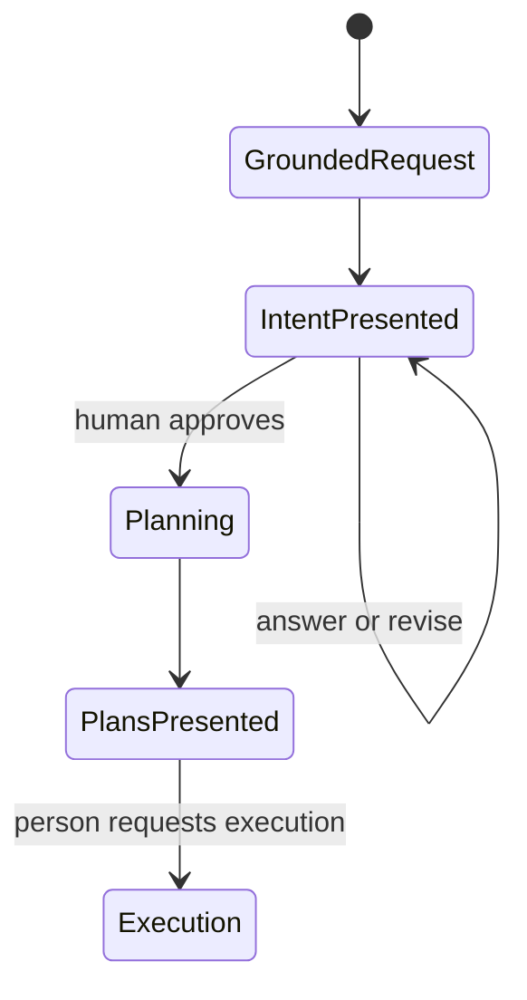
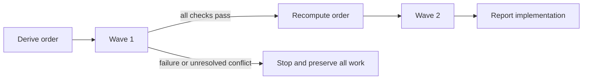
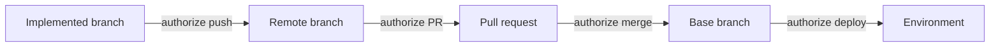
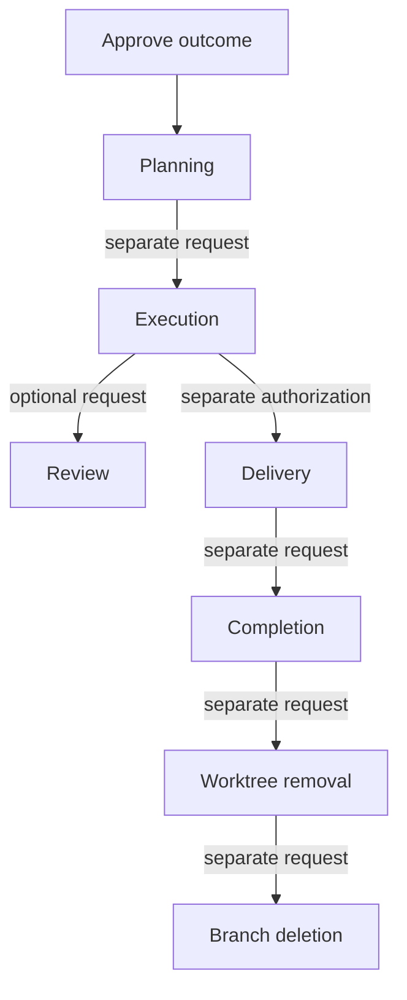

You do not need Context Circuit commands, record IDs, branch names, or internal vocabulary. Tell the coordinator the project outcome or decision in ordinary language. It chooses the matching procedure and uses the CLI for exact bookkeeping.

This cookbook covers the supported v2 conversation surface. The wording is illustrative: replace names, paths, repositories, branches, providers, and outcomes with your own.

## Learn what you opened

### Explain this workspace

> What is this project, which repositories belong to it, and what does the workspace already know?

The agent reads workspace identity, relationships, local bindings, and relevant knowledge. It explains the project without changing anything.

### Show current work

> What changes are currently planned or in progress, and which repositories do they affect?

The agent resolves records and checks real branches and diffs before describing implementation state.

### Check workspace consistency

> Check this Context Circuit workspace and explain every finding. Do not repair anything that needs my decision.

`check` is diagnostic. A finding names the command, edit, or human decision that discharges it.

## Create or join a workspace

### Create a new project workspace

> Create a Context Circuit workspace for “Acme Billing.” Its purpose is subscription billing for small businesses. Add me as Maya.

Initialization happens only on request. Add your preferred language and writing tone if intents and plans should use them.

### Join an existing workspace on another machine

> This is an existing team workspace. Set this machine up for member `maya`, connect the workspace checkout, and obtain the repositories already recorded here.

The agent selects the existing member and binds this machine. It does not initialize the shared workspace again.

### Add a member

> Add Alex to this workspace. Write Alex's intents and plans in Indonesian with a semi-formal tone and keep technical terms in English.

### Configure offline allocation

> Give Maya and Alex separate allocation bands so each can create records from an offline clone without choosing the same IDs.

Bands reduce one collision class; they are not distributed locking. Workspace commits still need synchronization before separate clones allocate.

## Connect repositories

### Connect an existing checkout

> Connect `../billing-api` as `api`. It owns billing rules and starts work from `main`.

### Clone a repository already described by the workspace

> Clone the `web` repository recorded in this workspace and use `release/24.4` as this machine's base branch.

The shared default branch and this machine's base branch are different facts.

### Register a new remote repository

> Add the existing checkout at `../notifications` as `notifications`, record its origin, and describe it as the service that sends billing emails.

### Initialize an empty repository

> Create a new local repository called `reporting`, connect it to the workspace, and use `main` as its initial branch.

### Record a relationship

> Record that `web` consumes the `api` billing endpoints and that `api` publishes invoice events to `notifications`.

### Describe the workspace repository

> Connect this workspace's own Git repository so team members know where the shared records travel.

The workspace repository is not a work repository and is not named by plans.

## Install and update Context Circuit

### Install the pinned CLI

> Install the Context Circuit CLI version this workspace pins and verify the installed binary.

### Update only the CLI

> Update the CLI used by this workspace to version `2.2.0`. Do not change the workspace template or existing records.

### Update the workspace template

> Update this workspace from its recorded template version to `2.2.0`. Show me the upstream delta and preserve our project-owned files and records.

The agent applies the version-to-version delta. It does not recopy a release over the workspace.

### Configure agent roles

> Show the explorer, planner, worker, and reviewer settings in force for Cursor on this machine.

> Configure the Cursor planner to use `<supported-model>` with high effort, then refresh the native role definitions without overwriting customized definitions.

Settings express host preferences. A generated definition does not prove the host loaded it.

## Build project knowledge

### Gather from named evidence

> Read `sources/billing-rules.md` and `sources/customer-interviews.md`. Turn the durable product rules into project knowledge, update the catalog and glossary, and keep raw evidence separate.

Only the exact named sources are read. The resulting notes describe the project, not those source files.

### Gather from repositories

> Document how invoices move from draft to paid by reading the relevant `api` and `web` code. Add durable knowledge with repository anchors.

### Query knowledge

> What does this project already know about invoice cancellation, credit notes, and overdue reminders?

The agent retrieves the smallest relevant set through the catalog instead of scanning every note.

### Add actor knowledge

> Document what a freelance seller and an accounts-payable reviewer each need from the invoice approval flow today.

Actor notes describe current needs, not a future backlog.

### Clarify vocabulary

> We use “void” and “cancel” differently. Record the project meaning and the code identifiers each repository uses.

### Mount organization knowledge

> Mount our `platform-knowledge` repository as read-only shared knowledge, using `index.md` as its catalog.

### Retrieve borrowed knowledge

> Find what our project and the mounted platform knowledge say about idempotency.

Matches identify which side owns each note. Borrowed knowledge is never copied into this workspace.

### Reconcile stale knowledge

> Check which owned knowledge may be stale against the code. Walk me through the findings and update only notes you actually re-read.

## Design before deciding an outcome

Use a system design when a large change needs its shape settled before it can be expressed as bounded outcomes.

> Design the end-to-end subscription billing system: actors, domain boundaries, repository responsibilities, data flow, failure behavior, and rollout constraints. Write it as source material; do not create intents or start implementation.

A design has no status and grants no approval. It is evidence an intent may cite when the outcome genuinely rests on it.

## Request a normal product change

### Start an intent

> Add recurring billing to the API and web app. Existing customers must remain on their current plans.

The agent retrieves relevant knowledge, writes the outcome it understood, asks numbered questions, and stops before detailed code investigation.

### Answer open questions

> 1. Monthly and annual plans only.  
> 2. Existing subscriptions keep their price until manually changed.  
> 3. Failed renewals retry for seven days.

### Approve the written outcome

> The intent matches what I want. I approve it.

Approval records your exact words and authorizes planning only. The agent then reads real code and writes linked plans without asking for planning permission.

### Correct the outcome before approval

> Do not include annual plans in this change. Update the intent and show it again.

### Change an approved outcome

> The success criteria must now include prorated upgrades. Update the intent and ask me to approve the changed outcome.

A material outcome change returns to the intent. An implementation detail inside the approved outcome does not.

## Make a direct change

### Explicitly bypass records and worktrees

> `/cc-direct` Fix the incorrect support email in the website checkout. Work on its current branch and leave the change uncommitted.

### Direct code change with an exact outcome

> Make this validation message say “Workspace name is required.” Change it directly in the bound `web` checkout, run the relevant test, and do not commit.

If the request turns out to need a product decision, the agent stops and offers the intent path.

## Explore without changing code

### Ask a bounded codebase question

> Find where invoice numbers are allocated, which database constraint makes them unique, and which tests cover collisions. Return evidence only.

### Compare repositories

> Trace how the `web` app submits an invoice and how `api` validates it. Identify mismatched assumptions without proposing a new outcome.

### Investigate feasibility before changing the intent

> Before I decide whether offline invoice creation belongs in the outcome, investigate the current synchronization model and tell me what is feasible.

Exploration is read-only. It cannot approve, plan, or implement a change by itself.

## Execute planned work

### Run one plan

> Execute `p0007`. Prepare its worktrees, implement the approved outcome, run the repository checks, and report what remains unverified.

### Run all plans for an intent

> Execute all plans for the recurring-billing intent. Derive their dependency order and recommend waves or a linear chain with the cost of each.

### Choose the execution shape

> Use waves for this run.

> Use a linear chain for this run.

### Resume interrupted work

> Resume `p0007`. Inspect the actual branches and diffs before trusting the plan record, preserve partial work, and continue from what Git shows.

### Handle a blocked run

> Explain which plans finished, which one is blocked, and which dependents are waiting. Preserve every branch and do not invent a repair for anything that needs my decision.

An execution request covers worktree preparation, implementation commits on the plan branches, and local integration merges required by that run. It does not authorize delivery.

## Use subagents

### Delegate exploration

> Use explorers to investigate the API retry policy and the web cancellation flow in parallel. Return evidence; do not edit either repository.

### Delegate implementation

> Dispatch one worker per ready plan, wait for every result, and integrate their reported checks. Stop if a worker is blocked.

### Use several workers in one worktree

> Split this plan into bounded worker tasks inside the same worktree. Make every worker preserve the others' edits.

One worker per plan owns a whole worktree. Several workers inside one worktree share files; the briefs must say which form is being used.

## Review

### Ordinary review

> Review the current branch diff for correctness, regressions, security risks, and missing tests. Do not change code.

### Independent review

> Independently review the changes for `p0007` against the intent's success criteria. Use a fresh read-only reviewer and report any limit on independence.

### Review a pull request

> Independently review pull request `<url>` and give me findings with locations. Do not post comments or launch fixes.

Independent review is optional, manually requested, and never an automatic delivery gate.

## Deliver work

Each outward action must be requested explicitly.

### Commit direct work

> Commit the direct website changes using the repository's commit convention. Do not push.

Worktree implementation commits are covered by execution; commits in a bound checkout are not.

### Push a branch

> Push the branch for `p0007`. Do not open a pull request.

### Open pull requests

> Open pull requests for the recurring-billing work against each machine's recorded base branch. Use only the chain-end branch for each repository.

### Update a pull request

> Update the API pull request description to reflect the revised retry behavior.

### Merge

> Merge pull requests `<api-url>` and `<web-url>` into their current targets.

### Deploy or publish

> Deploy the merged website revision to `<environment>` and report what was actually observed.

Delivery does not mark plans complete.

## Complete the circuit

### Complete one plan

> The change from `p0007` has landed. Mark the plan complete with these exact words: “Recurring billing shipped in the API.”

### Complete several plans

> The recurring-billing pull requests have landed. Mark all of its plans complete and reconcile the durable knowledge once across the set.

### State that knowledge did not change

> Complete `p0008`. This was a presentation-only correction; confirm whether any durable knowledge changed and record the result honestly.

Completion is the note plus knowledge reconciliation. Most completions change no durable concept.

## Organize and clean up

### Archive records

> Archive the completed recurring-billing intent and plans. Preserve every ID reservation and repair relative links.

> Restore `p0007` from the archive.

Archival is optional organization, not a lifecycle stage.

### Remove a worktree

> Remove the worktree for `p0007` if it is safe. Preserve dirty, untracked, and ignored files, and keep the branch.

### Discard a worktree explicitly

> Remove the `p0007` worktree and discard its dirty, untracked, and ignored files. Keep the branch.

### Delete a branch

> Delete the local `cc/p0007/api` branch after confirming its work is preserved elsewhere.

Worktree removal and branch deletion are separate requests.

## Recover and repair local mechanics

### Inspect worktrees

> List the real Git worktrees and explain any stale Context Circuit association.

### Move a worktree

> Move the worktree for `p0007` to `<new-path>` using Git and update the local association.

### Repair an association

> Repair the local worktree association for `p0007` from Git's inventory. Do not reset or recreate its branch.

### Change this machine's base

> Change the `api` checkout's base branch on this machine to `release/24.4`. Do not change the shared repository default.

## Ask for honest limits

These prompts are useful when evidence is incomplete:

> Report only checks you actually ran and observations you actually made. Call everything else unverified.

> Preserve partial work and tell me the smallest decision or external action needed to continue.

> Do not call the implementing session's own inspection independent.

> Do not print environment contents, credentials, provider payloads, or machine-specific paths into shared records.

## Requests that should not be combined

Keep these decisions explicit even if they happen in one conversation:

| Do not conflate | Why |
| --- | --- |
| Initial request and intent approval | The approved object is the written outcome |
| Intent approval and execution | Approval authorizes planning only |
| Execution and independent review | Review is optional and read-only |
| Execution and delivery | Push, PR, merge, and deploy are outward actions |
| Delivery and completion | Landing code does not reconcile knowledge |
| Completion and worktree removal | A completed branch may still be useful |
| Worktree removal and branch deletion | They preserve different artifacts |

