Context Circuit is a **living documentation system for a product or project**. A coordination layer keeps that documentation aligned with the code as work moves across sessions, people, machines, and repositories.

Its core asset is not an execution record. It is durable project knowledge: architecture, domain rules, decisions, conventions, vocabulary, actors, and repository relationships. AI-assisted implementation advances the circuit, but implementation is not the center of the product.

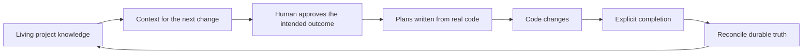

## Why it exists

A prompt can specify what to change while omitting why the current behavior exists, which product rules it must preserve, or what another repository depends on. An agent can follow the prompt correctly and still make the wrong product change.

Without a shared workspace, each conversation reconstructs the same understanding from source code, chat history, and human memory. Cross-repository work becomes disconnected tasks. Decisions disappear when the session ends. Documentation drifts because updating it is nobody's final step.

Context Circuit closes that return path. The next change begins with accepted understanding, and a completed change brings the affected understanding back for judgment.

<Callout title="What Context Circuit does not promise">It cannot prove that an agent understood the product or prevent every mistake. It makes assumptions, decisions, code changes, checks, and uncertainty inspectable.</Callout>

## The v2 trust model

Context Circuit does not treat its own records as proof that work happened.

> A record proves that the system wrote a record. The branch, the diff, the passing check, and the words a person actually said are the things that establish what happened.

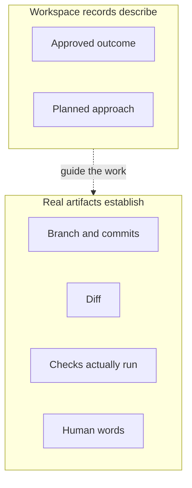

Three rules follow:

1. **Git is authoritative.** Resume from real branches and diffs, not a plan's description of them.
2. **Mechanism and judgment stay separate.** The CLI performs repeatable bookkeeping and Git operations. The agent interprets the project.
3. **Unobserved work stays unestablished.** A dispatch specification does not mean a worker ran; a generated role file does not prove the host loaded it.

## The project model

A workspace coordinates a whole project. It is not another name for one Git repository.

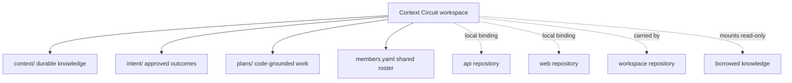

Shared files record logical repository IDs, URLs, default branches, relationships, members, knowledge, intents, and plans. Local files record the active member, checkout paths, and the branch this machine starts work from. A second machine selects an existing member and binds its own checkouts; it does not initialize the workspace again.

## The participants

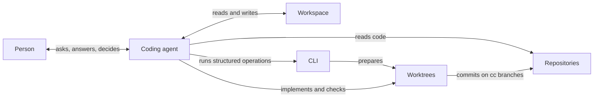

| Participant | Owns | Does not own |
| --- | --- | --- |
| Person | Product decisions and authorization | Commands, IDs, or internal file mechanics |
| Coding agent | Interpretation, planning, implementation, checks, and knowledge judgment | Human consent |
| Workspace | Shared understanding and coordination records | Machine paths, secrets, or provider payloads |
| CLI | IDs, structured edits, bindings, ordering, worktrees, and diagnostics | Models, product judgment, commits, pushes, or deployment |
| Repositories | Code and repository-specific conventions | Permission to cross workspace gates |
| Worktrees | Isolated implementation copies | Automatic cleanup |

## What the CLI owns and what the agent owns

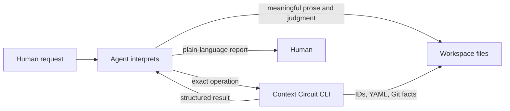

The CLI is model-blind and credential-free. It allocates IDs, edits structured files, resolves bindings, derives dependency order, prepares worktrees, and reports diagnostics. It does not call a model, execute a plan, run application setup, commit, push, merge, deploy, or approve anything.

The agent chooses meaningful slugs, writes everything a person reads, decides which repositories matter, judges whether knowledge changed, launches host-native subagents, and explains uncertainty.

## Knowledge, sources, and records

These artifact classes have different lifetimes and must remain separate:

| Location | Meaning | Reading rule |
| --- | --- | --- |
| `sources/` | Passive raw evidence and system designs | Read only exact files named by the person or task |
| `context/` | Durable accepted knowledge owned by this workspace | Retrieve selectively through its catalog |
| Knowledge repositories | Durable knowledge owned elsewhere | Mount and read; never copy or edit here |
| `intent/` and `plans/` | What was approved and how work was planned | Resolve by ID; may be archived |

A durable note describes the project, not the machinery that produced it. It never names an intent, a plan, or a source file. Repository anchors belong in one `Owner:` block. The catalog entry and note move together. The reviewed date is checked against commits under those anchors, not merely against the calendar.

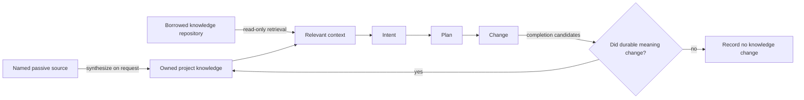

## The human-controlled change path

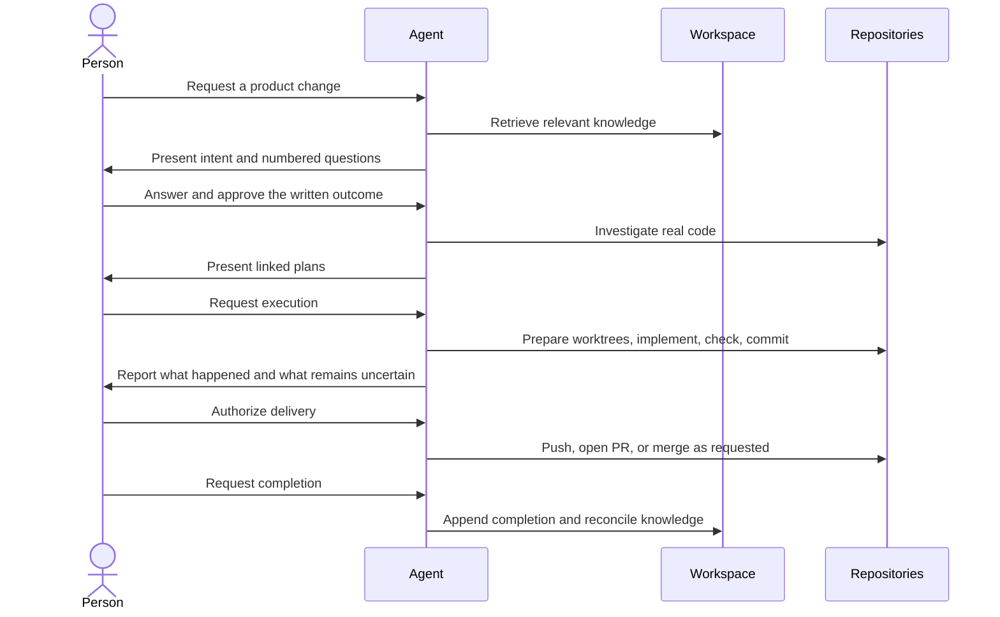

An intent approval authorizes planning only. There is no plan approval gate, but execution waits for a request made after the plans exist. Delivery, completion, worktree removal, and branch deletion are separate acts.

## Direct changes

A person may explicitly bypass intent, planning, and worktree preparation when the request is already its own specification.

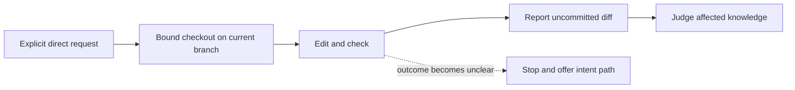

The direct path writes no record and allocates no ID. It preserves existing work. A commit in the person's checkout still needs authorization, as do push, PR creation, merge, publication, and deletion.

## Several plans

`record order` derives dependency waves, starting references, fan-in merges, and plans that share repositories. It runs and reserves nothing.

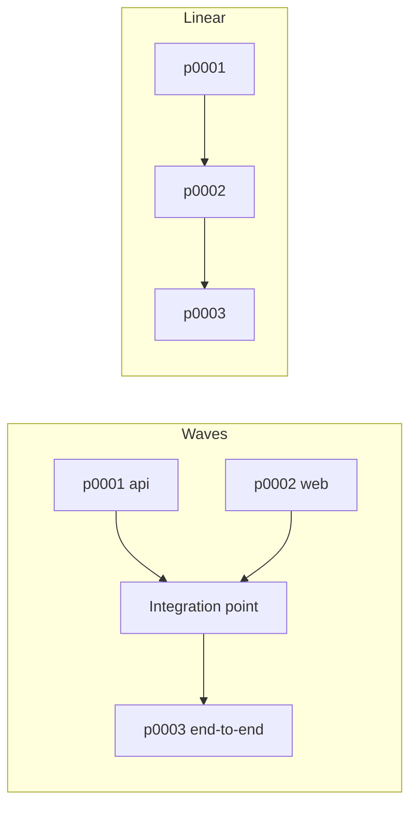

Waves reduce wall-clock time when independent plans live in separate repositories. A linear chain avoids integration merges in a single repository. Failed checks, unresolved conflicts, blocked workers, refused worktree preparation, failed setup, and invalid dependency order stop the run while preserving every completed and partial branch.

## Review, delivery, completion, and cleanup

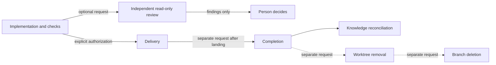

Independent review is manually requested and never edits code or launches repairs. It does not mechanically gate delivery or completion. Delivery uses ordinary Git and provider tools. Completion appends the person's note and reconciles durable knowledge. Cleanup never happens implicitly.

## Products and repositories

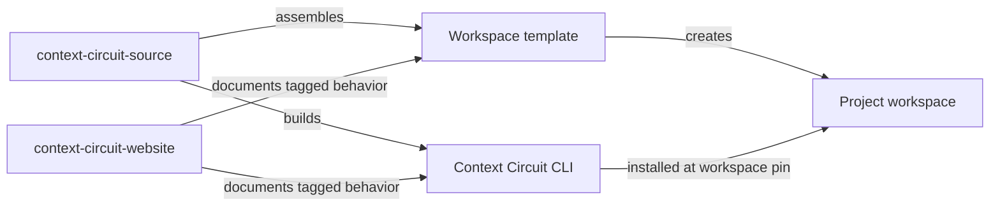

`context-circuit-source` owns shipped instructions, skills, CLI source, tests, and release assembly. `context-circuit` publishes the workspace template on `v*` tags. The CLI is published from source on `cli-v*` tags. `context-circuit-website` owns this curated documentation. The template and CLI have independent release identities even when their version numbers match.

## What Context Circuit deliberately does not have

Context Circuit v2 has no consequence tiers, frozen contract digests, candidate identities, path leases, execution records, verification records, host-evidence records, automatic repair loops, compulsory delegation, plan approval gate, or automatic provider synchronization.

Those mechanisms produced ceremony and records that looked like proof. V2 keeps the artifacts a person can inspect directly and requires honest reporting of what was not established.

## Continue

- [Prompt cookbook](/docs/prompts) — ordinary-language prompts for the supported cases.
- [Get started](/docs/get-started) — create a workspace and take one change through the circuit.
- [Concepts](/docs/concepts) — detailed records, knowledge, worktrees, and authority boundaries.
- [Workflows](/docs/workflows) — each stage as a practical conversation.
