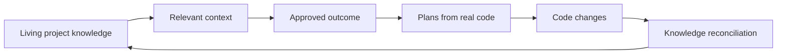

<HomeIntro />

## Why it exists

A request can say exactly what to change and still leave out why the current behavior exists, which product rules it must preserve, or what else the change will affect. An agent can follow that prompt faithfully and still produce a locally correct change that is wrong for the product.

Context Circuit makes accepted knowledge available before the outcome is written down. Contradictions and missing decisions become questions for a person. Plans come from real code after that outcome is approved. When implementation changes a durable rule, completion reconciles the knowledge so the next session does not rediscover it.

It does not prove an agent understood the product, and it does not prevent every mistake. Records make assumptions inspectable. The CLI validates files and Git mechanics. Project judgment stays with the agent. Consequential choices stay with you.

## A workspace above your repositories

A workspace holds the project understanding and coordination records shared by a solo developer or team. Repositories hold implementation. Local bindings say where each checkout lives on this machine. That separation lets one intended outcome coordinate several repositories without storing anyone's machine paths in shared files.

The CLI keeps IDs, structured files, and Git mechanics dependable. The coding agent does the reasoning and implementation. You approve the intended outcome and authorize outward actions.

## Two products

The **workspace template** supplies the shared project folder: instructions, skills, knowledge, intents, and plans. The **CLI** is the native tool that writes structured records and prepares working copies. This website cites each release independently. They can share a version number without sharing a release identity.

<ReleasePicker />

Create a workspace from [template 2.1.0](/docs/get-started/install), read the complete [product model](/docs/understand), or use the [prompt cookbook](/docs/prompts).
